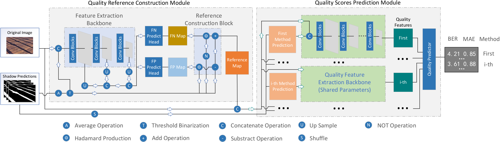

# No-reference Shadow Detection Quality Assessment via Reference Learning and Multi-Mode Exploring

This is the demo code for paper "No-reference Shadow Detection Quality Assessment via Reference Learning and Multi-Mode Exploring".

## Method Framework



## Usage:

### 1. Prepare Pytorch Environment
```shell script
conda env create -f envs.yaml

conda activate pim
```

### 2. Run inference code
```angular2html
./run_eval_EvaNet_Base_fuse.sh
```
The result file will be saved in 'ckpt/Batch/Demo_ber_results.txt', which represents the prediction results of the Batch mode in the four scenarios in Table 2 and Figure 5.